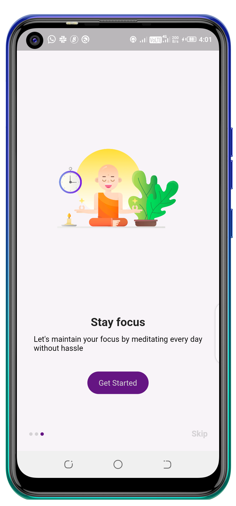

# sheCodeTask1

A new Flutter project.

## Design Challenge 1

<table>
<tr>
<td style="text-align: center">
    
</td>
<td style="text-align: center">

</td>
<td style="text-align: center">
    
</td>
</tr>
</table>

